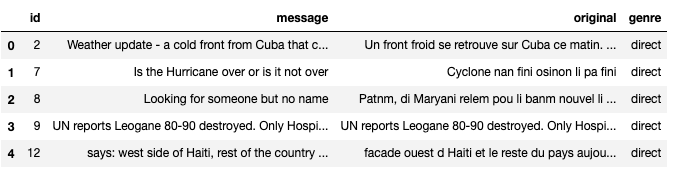
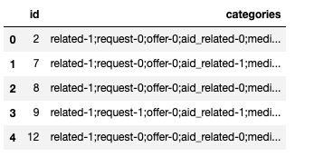
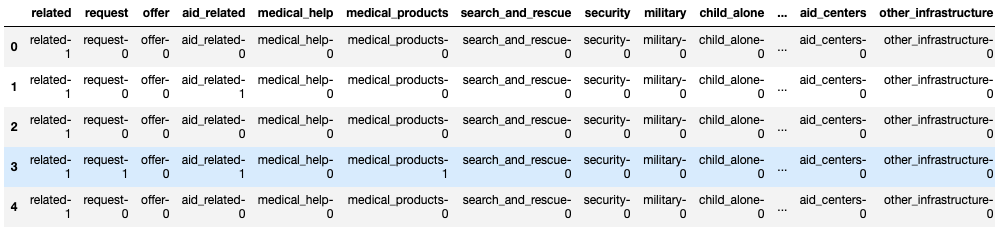
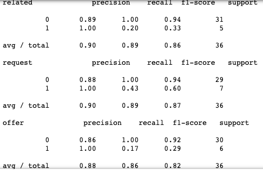
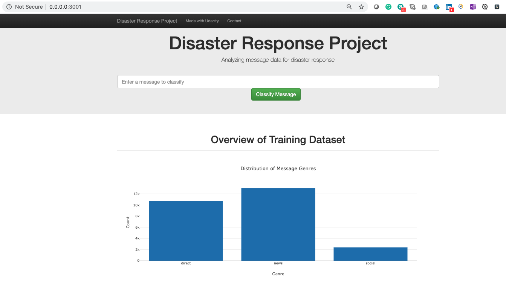
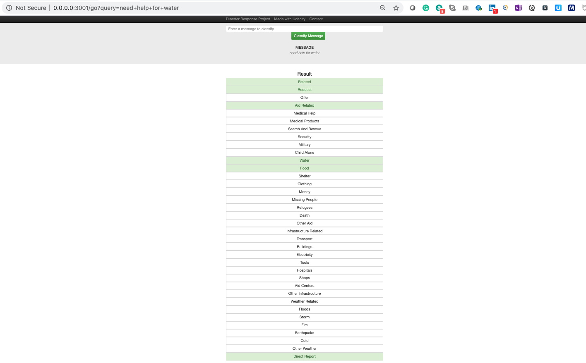
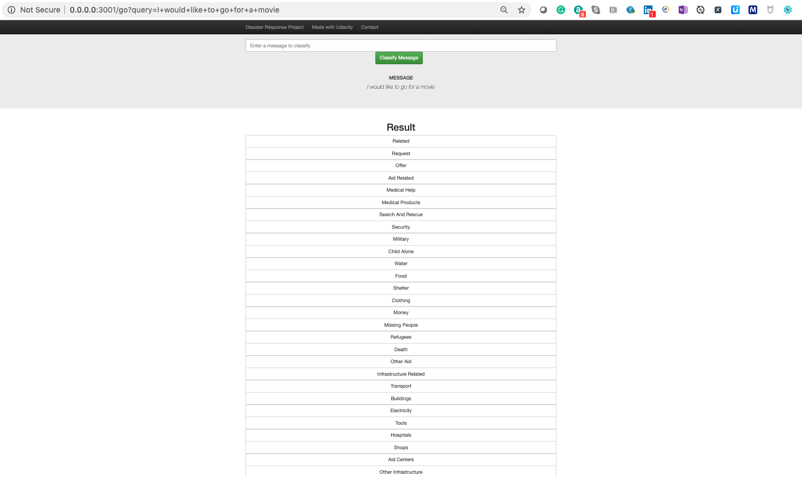

# Disaster Response ML PipeLine
Disaster Response Machine Learning Binary Classification PipeLine

## I. Definition
Digitalization and the rise of social media have led disaster management to the insight that modern information technology will have to play a key role in dealing with a crisis. 

### Project Overview

 In this context, the paper introduces a NLP software for social media text analysis that has been developed in cooperation with disaster managers in the European project Slandail. The aim is to show how state-of-the-art techniques from text mining and information extraction can be applied to fulfil the requirements of the end-users. By way of example use cases the capacity of the approach will be demonstrated to make available social media as a valuable source of information for disaster management.

[Abstracts](https://link.springer.com/chapter/10.1007/978-3-319-73706-5_17)

[Statistical Approches](http://communities.unescap.org/system/files/merged_rev1_final.pdf)

[Research Papaers](http://foresight.ifmo.ru/ict/shared/files/201312/1_193.pdf)

### Problem Statement

* Hurricane Dorian wreaked havoc in the Bahamas. Massive fires raged through the Amazon forest. A 7.1-magnitude earthquake and aftershocks rocked Southern California this summer. Kerala, India, suffered the biggest flood in nearly a century.

* It is painfully obvious that natural disasters all over the world are inflicting increasing amounts of damage—and it is likely that even more destructive events will occur in the future. But how can we defend and protect ourselves against the inevitable disasters to come?

* The answer lies in our ability to better forecast, plan for and respond to natural disasters

* Can a Machine Learning algorithm resolves the problem?

### Metrics
This machine pipeline should take in the message column as input and output classification results on the other 36 categories in the dataset. Used MultiOutputClassifier helpful for predicting multiple target variables and used classification_report to get the metrics like accuracy, precision and recall.

## II. Analysis

### Data Exploration

Provided data is having messages(messages.csv) and their respective categories(categories.csv)

Messages are having lot of special charaters which needs to be eliminated
Categories data is having representations like 0(not belongs to) and 1(belongs to) against the category

### Label data:

(messages.csv)

#### id	: Unique Identifier
#### message: Translated to english message
#### original: Original Message
#### genre: Belongs to Group

(categories.csv)

#### id	: Unique Identifier
#### categories: All the types of categories with ';' seperated with 0,1 and 2 representation

#### The Shape of the data for messages,categories is (26248, 4) and (26248, 2)

#### abnormalities

There are abnormalities like special charaters and stemming. In order to get machine learning readability should remove them by using following
1. Regular Expression
2. CountVectorizer : Convert a collection of text documents to a matrix of token counts
3. TfidfTransformer : Tf means term-frequency while tf-idf means term-frequency times inverse document-frequency

### Exploratory Visualization
Since provided messages and categories are related data, we need to merge them first and complete the data wragling.

### Algorithms and Techniques
As we have more categories for messages, to solve the problem I have used MultiOutputClassifier with Machine Learning pipeline approach

As we have data related to text, for text analysys and cleaning used scikit-learn ntlk packages like 2. CountVectorizer, TfidfTransformer

#### MultiOutputClassifier Algorithm
 This strategy consists of fitting one classifier per target. This is a simple strategy for extending classifiers that do not natively support multi-target classification

Probability estimates. Returns prediction probabilities for each class of each output.

This method will raise a ValueError if any of the estimators do not have predict_proba.

### Grid Search 

Exhaustive search over specified parameter values for an estimator.

Important members are fit, predict.

GridSearchCV implements a “fit” and a “score” method. It also implements “predict”, “predict_proba”, “decision_function”, “transform” and “inverse_transform” if they are implemented in the estimator used.

The parameters of the estimator used to apply these methods are optimized by cross-validated grid-search over a parameter grid.

[scikit-learn Documentation](https://scikit-learn.org/stable/modules/generated/sklearn.model_selection.GridSearchCV.html)


## III. Methodology

### Data Preprocessing
* Since provided messages and categories are related data, we need to merge them first and complete the data wragling.

* Split the values in the categories column on the ; character so that each value becomes a separate column.

* Used the first row of categories dataframe to create column names for the categories data.
Renamed columns of categories with new column names.

* Create a dataframe of the 36 individual category columns.

* selectd the first row of the categories dataframe and used the row to extract a list of new column names for categories.

* Used lambda funtions ro slice the second to last character of each string with slicing.

* After applying above techniques, the final data looks like below.

### Implementation
#### Challenges : 

##### 1. Data Types : 
Data Engineering part was quite challenging to prepare the in desired format for machine learning
##### 2. Overfitting in neural networks:
Efficiency of a model is judged by its ability to perform well on an unseen data set and not by its performance on the training data fed to it.
##### 3. Grid-Search Optimization : 
As there are limited documentation it is very difficulty to work with hyper-parameters tuning. If accuracy is not good then changing them with train and error approach is not good.
##### 4. Blackbox : it is very difficulty to understand the behavior behind the scenes. 

### Refinement
Grid-Search technique helped alot to finout right features for training data and improved perfomance.

## IV. Results

### Model Evaluation and Validation

Reported the f1 score, precision and recall for each output category of the dataset.Iterated through the columns and calling sklearn's classification_report on each.

### Justification
Model is working as expected but there is a room for improvement to increase accuracy. Need to gather more data to provide enough training split so that it learns more to produce better results.
Right now results are encouraging and tested for multiple data scenarios. 

## V. Conclusion

### Free-Form Visualization
In order to view the results developed a web applicaiton that takes existing training data and shows metrics and provide a feature to enter the messages and classifies the same.

### Reflection
Solving the problem by using binary classfication is quite challenging in terms of data preparation and building pipeline.
Web applicaiton deployment also quite intresting to task to feed the live data to machine learning to categorise based on train data
Model has built in generic and such a way that it will work to categories all types of disaster responses
### Improvement
Custom model would be best fit to get more accuracy.Through the effective use of Neural Networks (Deep Learning Models), binary classification problems can be solved to a fairly high degree.